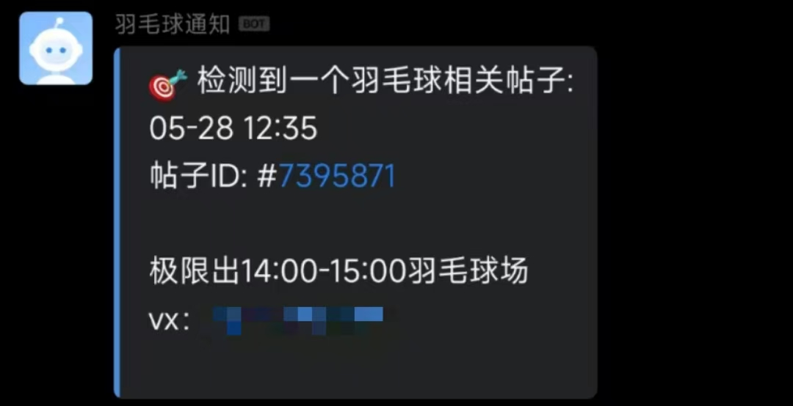

<p align="center">
  
</p>

## 介绍

本项目旨在及时检测北京大学树洞中关于羽毛球场地的信息并通知。一旦检测到有人出场一分钟内企业微信通知到手机，方便使用者及时捡漏，解决当天想打球但缺场/无场/掉进树洞的困境。


### 安装

1.  在根目录配置 `user.config` (从 `example/user.config.example` 复制并填入你的 [AiHubMix](https://aihubmix.com/token) API Key 和企业微信机器人链接 [创建方法](https://open.work.weixin.qq.com/help2/pc/14931)) 用于调用大模型进行评估和发送通知。请先在企业微信创建群组后添加机器人，然后把机器人链接填入 `user.config`。

2.  安装依赖：

    ```bash
    pip install -r requirements.txt
    ```

### 使用

3. 运行 `app.py` 启动整个应用：

    ```bash
    python app.py
    ```

    **注意：** 每次启动后，`fetcher.py` 会首先尝试登录树洞，请手动完成登录，注意每天短信验证码次数有限制（5次）。登录完成后，在命令行回车，程序将开始运行。

    这个文件会同时运行 `fetcher.py`、`evaluator.py` 和 `notify.py`，实现自动抓取、评估、筛选树洞帖子以及发送通知。

### 文件说明

*   `fetcher.py`: 负责从北京大学树洞抓取帖子，并将结果保存到 `treehole_posts.json` 文件中。
*   `evaluator.py`: 负责读取 `treehole_posts.json` 中的帖子，使用 OpenAI API 评估帖子内容是否与羽毛球场地相关，并将评估结果保存到 `evaluated_posts.json` 文件中。
*   `notify.py`: 负责读取 `evaluated_posts.json` 中的帖子，使用企业微信机器人发送通知。
*   `utils.py`: 包含了一些常用的工具函数，如获取配置等。
*   `user.config`: 配置文件，用于存储 OpenAI API Key 和企业微信机器人链接。


### 友情提示

本项目一开始设计为自用（实在约不到羽毛球场TAT），如有需要，可以添加功能和维护，例如支持本地部署服务器（珍惜￥￥）。
